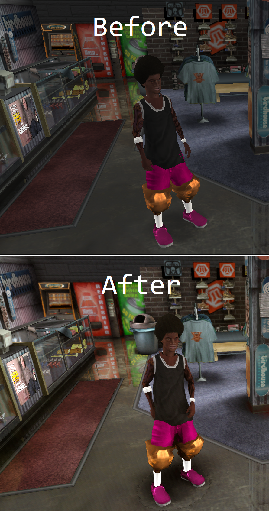

# thug-pro-reshade

Reshade Settings for THUG Pro.

## Preview




## Installation

### If you have bash, run:

```bash
$ ./reshade install <windowsUsername>
```

### Otherwise:

Copy the contents of the `THUG Pro` directory into the `THUG Pro` game directory (`%appdata%/Local/THUG Pro`).

## Usage

When you open the game, the effects will be loaded.

You can tweak the effects by modifying the `.cfg` files in the `THUG Pro/scripts/ReShade/Presets/thugpro` directory.

When you export effects, the game will load the effects without needing to restart.

Play around and see what effects you can achieve!

Most effects can be disabled by pressing the Scroll Lock key.

## Importing effects to Repository

(Requires bash)

```bash
$ ./reshade import <windowsUsername>
```

## Exporting effects to THUG Pro

(Requires bash)

```bash
$ ./reshade export <windowsUsername>
```

## Credits

Shaders by:
* Alo81
* bacondither
* CeeJay
* Ganossa
* IDDQD
* Ioxa
* JPulowsky
* MartyMcFly
* Otis

Special Thanks:
* Edem (for sending me his reshade configuration, and helping me recover lost files)
